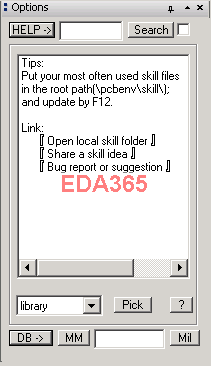

<script type="text/javascript" src="http://www.evel.cn/javascripts/chatra.js"></script>
<script>
window.ChatraSetup = {
    mode: 'frame',
    /* id of the block you want to embed chat into */
    injectTo: 'chatgpt',
};
</script>
<script>
Chatra('expandWidget');
</script>

# 欢迎你使用Loginshow

Loginshow是一个Allegro Skill Loader，算是学习EDA开发以来第一个分享给同行的工具。主要用来加载Allegro skill脚本。自从在EDA365第一次发布以来，已经走过了10年光阴。
注：考虑Google被墙，后面去掉了原网站的讨论和分享区。这就是为什么你看到这个页面的原因。-- 2021/1，Evel



## 使用方法：

非常简单，第一次解压，双击就可以用了，第二次以后直接按照以前的方式启动allegro就行了，F12是快捷键。

常见问题：
```
1，无法加载成功：
如果加载后再pcbenv下面可以找到loginshow.il文件；allegro.ilinit会增加加载代码。手动也是一样的和之前没啥区别。密码www.pcbskill.com
2，一些快捷键：
F8：以时间后缀保存database
F9：查看物件属性
F11：打开Database目录
F12：是启动程序快捷键
Ctrl+Up：截屏（v163新增）
```

## 版本介绍：

### Loginshow v4.0

这个版本主要增加了

> 1，一部分常用的功能，如定位，查找，搜索，转换,截屏。尽量的傻瓜和智能。
> 2，一个在线讨论区，方便大伙有疑问不用上Q也能一起讨论。数据库是Google的。
> 3，一个订阅和分享文章的区，欢迎投稿给我们。
> 4，针对开发者有一些检查代码，函数查询，属性查看等贴心功能。

这个版本是因为工作忙,比较长时间没弄所以大家等的也很久；对此感到抱歉。大家多帮忙测试吧，还有什么改进想法可以再联系我。因为网站有时候故障，我就先放把程序到了QQ群40025651和107581703里。

-2011-3-7

### Loginshow v3.2

主要介绍

> 1，一次性免去所有的菜单更改，人工加载等繁琐步骤。
> 2，该工具可以加载大部分目前网络流行的skill代码。包括了绝大部分加密和不加密的skill； 
> 3，对热门的skill进行归类存放，方便加载和查找；
> 4，并且对skill名称无限制(含中文)
> 5，还方便调试开发如果有密码的情况第一次加载成功之后进行将系统记录，不用再输入密码，直接鼠标操作，不用任何键盘调用动作。 

-2009-12

### Loginshow v2.0

> 1，加载代码的一些优化
> 2，列表生成的优化
> 3，密码更新

-2009-3

### Loginshow v1.0

> 1,初步的架构和功能实现。

-2008-9

### 下载链接
[点我跳转](https://www.eda365.com/forum.php?mod=viewthread&tid=47466)

<div id="chatgpt">
</div>
